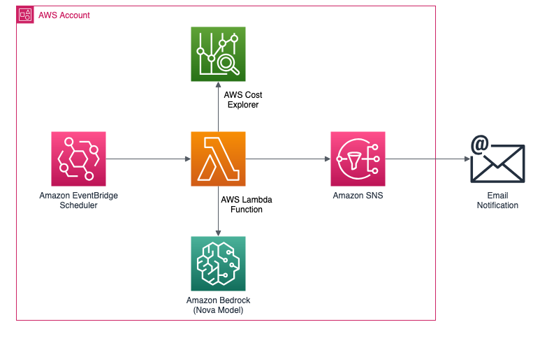

# AWS Billing Insights



Automated AWS billing analysis and cost optimization tool powered by Amazon Bedrock LLMs. Get intelligent insights, forecasts, and actionable recommendations delivered directly to your inbox via SNS.

## Overview

AWS Billing Insights is a serverless solution that analyzes your AWS spending patterns using AI-powered insights from Amazon Bedrock. The system automatically generates comprehensive billing reports with cost forecasts, optimization recommendations, idle resource detection, and budget alerts.

## Features

### Core Analytics
- **Cost Analysis**: Detailed breakdown by service, region, and linked accounts
- **Trend Analysis**: Month-over-month (MoM) and quarter-over-quarter (QoQ) growth tracking
- **Cost Forecasting**: AI-powered next-month cost predictions using AWS Cost Explorer
- **Budget Monitoring**: Automated alerts when spending exceeds defined thresholds
- **Historical Trends**: 6-month historical cost analysis with growth rate calculations

### Optimization & Recommendations
- **Idle Resource Detection**:
  - Low CPU EC2 instances (<5% average utilization)
  - Unattached EBS volumes
  - Unattached Elastic IPs
  - Old snapshots (>90 days)
  - Idle RDS instances (<1 average connection)

- **Service-Specific Recommendations**:
  - Stopped EC2 instances with ongoing EBS costs
  - S3 buckets without lifecycle policies
  - NAT Gateway optimization opportunities
  - Data transfer cost reduction strategies

### Advanced Features
- **Savings Plans Utilization**: Track SP usage and identify unused commitments
- **Reserved Instances Utilization**: Monitor RI efficiency and wasted capacity
- **Data Transfer Analysis**: Break down inter-region, inter-AZ, and internet egress costs
- **Year-over-Year Comparison**: Seasonal trend analysis (14-month historical data)
- **Daily Spike Detection**: Identify unusual spending patterns with daily granularity
- **Multi-Currency Support**: Convert costs to 8 major currencies with historical exchange rates

### AI-Powered Insights
- **LLM Analysis**: Intelligent report generation using Amazon Bedrock models
- **Executive Summary**: Auto-generated high-level overview with action items
- **Anomaly Detection**: Identify services with >10% cost changes
- **Risk Alerts**: Proactive warnings for budget overruns and underutilized resources

## Architecture

The solution uses a serverless architecture:

1. **EventBridge Scheduler**: Triggers Lambda on a configurable schedule
2. **Lambda Function**: Collects billing data from AWS Cost Explorer and resource APIs
3. **Amazon Bedrock**: Generates intelligent analysis and recommendations
4. **SNS**: Delivers formatted reports via email/SMS
5. **CloudWatch**: Logs and monitoring

## Supported Bedrock Models

All models support `ap-south-1` region with no marketplace subscription required:

- `openai.gpt-oss-120b-1:0` (Default)
- `openai.gpt-oss-20b-1:0`
- `zai.glm-4.7-flash`
- `amazon.nova-pro-v1:0`
- `amazon.nova-micro-v1:0`
- `amazon.nova-lite-v1:0`
- `anthropic.claude-3-haiku-20240307-v1:0`

## Prerequisites

1. AWS Account with Cost Explorer enabled
2. Amazon Bedrock access in your deployment region
3. SNS topic for notifications
4. IAM permissions for CloudFormation deployment

## Deployment

### Quick Deploy

```bash
aws cloudformation create-stack \
  --stack-name aws-billing-insights \
  --template-body file://billing-insights.yaml \
  --parameters \
    ParameterKey=snsTopicArn,ParameterValue=arn:aws:sns:REGION:ACCOUNT:TOPIC \
    ParameterKey=MonthlyBudget,ParameterValue=1000 \
  --capabilities CAPABILITY_NAMED_IAM \
  --region ap-south-1
```

### AWS Console Deployment

1. Navigate to CloudFormation in AWS Console
2. Click "Create Stack" → "With new resources"
3. Upload `billing-insights.yaml`
4. Configure parameters (see Configuration section)
5. Review and create stack

## Configuration Parameters

### Required Parameters

| Parameter | Description | Default |
|-----------|-------------|---------|
| `snsTopicArn` | SNS Topic ARN for notifications | - |

### Core Settings

| Parameter | Description | Default |
|-----------|-------------|---------|
| `Region` | AWS Region for deployment | `ap-south-1` |
| `ModelId` | Bedrock LLM model | `openai.gpt-oss-120b-1:0` |
| `AccountName` | Friendly account name (optional) | `""` |
| `ScheduleExpr` | Execution schedule | `rate(30 days)` |
| `MonthlyBudget` | Budget threshold (0=disabled) | `0` |
| `Granularity` | Cost data granularity | `MONTHLY` |

### Cost Filtering

| Parameter | Description | Default |
|-----------|-------------|---------|
| `ExcludeCredits` | Exclude AWS credits | `true` |
| `ExcludeTax` | Exclude tax charges | `true` |
| `CurrencyCode` | Report currency (Disabled/USD/EUR/GBP/JPY/CNY/INR/AUD/CAD) | `Disabled` |

### Feature Toggles

| Parameter | Description | Default |
|-----------|-------------|---------|
| `EnableForecast` | Next-month cost forecast | `true` |
| `EnableSPUtilization` | Savings Plans analysis | `true` |
| `EnableRIUtilization` | Reserved Instances analysis | `true` |
| `EnableLinkedAccounts` | Multi-account breakdown | `false` |
| `EnableCostByRegion` | Regional cost breakdown | `true` |
| `EnableYoYComparison` | Year-over-year comparison | `false` |
| `IncludeCurrentMonth` | Include month-to-date data | `false` |
| `EnableServiceRecommendations` | Service-specific tips | `true` |
| `EnableCostOptimization` | Idle resource detection | `true` |
| `EnableHistoricalTrends` | 6-month trend analysis | `true` |
| `EnableDataTransferAnalysis` | Data transfer breakdown | `true` |
| `EnableIdleResourceDetection` | Idle resource scanning | `true` |

### Schedule Options

| Expression | Description |
|------------|-------------|
| `rate(1 day)` | Daily |
| `rate(7 days)` | Weekly |
| `rate(30 days)` | Monthly (default) |
| `cron(0 0 1 * ? *)` | 1st of every month |
| `cron(0 0 L * ? *)` | Last day of every month |
| `cron(0 0 15 * ? *)` | 15th of every month |
| `cron(0 0 ? * MON *)` | Every Monday |
| `cron(0 0 ? * FRI *)` | Every Friday |
| `cron(0 0 1 */3 ? *)` | Quarterly |
| `cron(0 0 1 */6 ? *)` | Semi-annually |

### Supported Currencies

`Disabled` (default), `USD`, `EUR`, `GBP`, `JPY`, `CNY`, `INR`, `AUD`, `CAD`

**Currency Conversion Features:**
- Set to `Disabled` to skip currency conversion and report in USD only (no exchange rate information)
- When enabled, uses historical exchange rates from Frankfurter API (European Central Bank data)
- Month-specific rates applied for accurate historical cost reporting
- Each month's costs converted using the exchange rate from the 1st day of that month
- Forecast and current month use the latest available exchange rate

## Report Sections

Generated reports include:

1. **Executive Summary**: High-level overview with key metrics, action items, and cost basis (credits/tax exclusions)
2. **Cost Summary**: Total spend, monthly breakdown, and trends
3. **Top 5 Cost Drivers**: Services consuming the most budget
4. **Month-over-Month Changes**: Services with significant cost variations
5. **Cost Forecast**: Predicted next-month spending (if enabled)
6. **Budget Status**: Current spend vs. budget threshold (if configured)
7. **Savings Plans Utilization**: SP efficiency and unused commitments (if enabled)
8. **Reserved Instances Utilization**: RI efficiency and wasted capacity (if enabled)
9. **Cost by Region**: Regional spending breakdown (if enabled)
10. **Cost by Linked Account**: Multi-account analysis (if enabled)
11. **Daily Spike Analysis**: Unusual spending patterns (if DAILY granularity)
12. **Year-over-Year Comparison**: Seasonal trends (if enabled)
13. **Historical Trends**: 6-month trends with MoM/QoQ growth (if enabled)
14. **Data Transfer Costs**: Detailed breakdown with service-level and usage-type analysis (if enabled)
    - Inter-region transfer costs by service and usage type
    - Inter-AZ transfer costs by service and usage type
    - Internet egress costs by service and usage type
    - Data volume in GB for each category
    - LLM-generated summary explaining causes and optimization recommendations
15. **Idle Resources**: Detected unused resources with cost impact (if enabled)
16. **Optimization Recommendations**: Service-specific cost savings (if enabled)
17. **Anomalies & Risk Alerts**: Critical issues requiring attention

## IAM Permissions

The Lambda function requires the following permissions:

- **Cost Explorer**: `ce:GetCostAndUsage`, `ce:GetCostForecast`, `ce:GetSavingsPlansUtilizationDetails`, `ce:GetReservationUtilization`
- **Bedrock**: `bedrock:InvokeModel`
- **SNS**: `sns:Publish`
- **EC2**: `ec2:DescribeInstances`, `ec2:DescribeVolumes`, `ec2:DescribeAddresses`, `ec2:DescribeSnapshots`, `ec2:DescribeNatGateways`
- **CloudWatch**: `cloudwatch:GetMetricStatistics`
- **RDS**: `rds:DescribeDBInstances`, `rds:DescribeDBClusters`
- **S3**: `s3:ListAllMyBuckets`, `s3:GetBucketLocation`, `s3:GetBucketLifecycleConfiguration`
- **Organizations**: `organizations:ListAccounts` (for linked accounts)
- **Compute Optimizer**: `compute-optimizer:GetEC2InstanceRecommendations`, `compute-optimizer:GetEBSVolumeRecommendations`

## Cost Considerations

- **Lambda**: ~$0.01-0.05 per execution (depends on data volume)
- **Bedrock**: Model-specific pricing (Nova Micro is most cost-effective)
- **Cost Explorer API**: $0.01 per request
- **SNS**: $0.50 per million notifications
- **CloudWatch Logs**: Minimal storage costs

Estimated monthly cost: **$2-10** for typical usage (monthly reports)

## Troubleshooting

### Common Issues

1. **"Access Denied" for Cost Explorer**
   - Enable Cost Explorer in AWS Billing Console
   - Wait 24 hours for data to populate

2. **"Model not found" error**
   - Verify Bedrock model access in your region
   - Check model ID spelling and region prefix

3. **Empty or incomplete reports**
   - Ensure Cost Explorer has at least 3 months of data
   - Check Lambda CloudWatch logs for API errors

4. **Currency conversion failures**
   - Frankfurter API requires internet access
   - Falls back to USD if conversion fails

5. **Linked accounts not showing**
   - Requires AWS Organizations
   - Enable `EnableLinkedAccounts` parameter

### Debugging

View Lambda logs:
```bash
aws logs tail /aws/lambda/STACK-NAME-ACCOUNT-REGION --follow
```

Test Lambda manually:
```bash
aws lambda invoke \
  --function-name STACK-NAME-ACCOUNT-REGION \
  --payload '{}' \
  response.json
```

## Customization

### Modify Report Format

Edit the Lambda function code in the CloudFormation template to customize:
- Report sections and ordering
- Threshold values for alerts
- Currency formatting
- Email subject line

### Add Custom Metrics

Extend the Lambda function to include:
- Custom CloudWatch metrics
- Third-party cost data
- Business-specific KPIs
- Additional AWS service analysis

### Integration with Other Tools

The solution can be integrated with:
- Slack/Teams via SNS → Lambda webhook
- Ticketing systems (Jira, ServiceNow)
- BI tools (QuickSight, Tableau)
- Cost management platforms

## Security Best Practices

1. **Least Privilege IAM**: Use the provided IAM roles with minimal permissions
2. **SNS Encryption**: Enable encryption at rest for SNS topics
3. **VPC Deployment**: Deploy Lambda in VPC for enhanced security (optional)
4. **Secrets Management**: Store sensitive data in AWS Secrets Manager
5. **CloudTrail Logging**: Enable CloudTrail for audit trails

## Limitations

- Cost Explorer data has 24-hour delay
- Year-over-year comparison limited to 14 months (AWS Cost Explorer retention)
- Idle resource detection limited to 20-100 resources per type (performance optimization)
- Currency conversion requires internet access (uses external API)
- Daily granularity increases API costs and execution time

## Roadmap

- [ ] Cost anomaly detection with ML
- [ ] Multi-region deployment support
- [ ] Custom dashboard with QuickSight
- [ ] Slack/Teams native integration
- [ ] Cost allocation tag analysis
- [ ] Rightsizing recommendations
- [ ] Spot instance savings analysis

## Contributing

Contributions are welcome! Please:

1. Fork the repository
2. Create a feature branch
3. Test changes thoroughly
4. Submit a pull request with detailed description

## License

This project is licensed under the MIT License.

## Support

For issues, questions, or feature requests:
- Open a GitHub issue
- Check CloudWatch logs for errors
- Review AWS Cost Explorer data availability

## Acknowledgments

- Amazon Bedrock for AI-powered insights
- Frankfurter API for currency conversion
- AWS Cost Explorer for billing data

---

**Note**: This solution is provided as-is. Always review generated recommendations before taking action on production resources.
